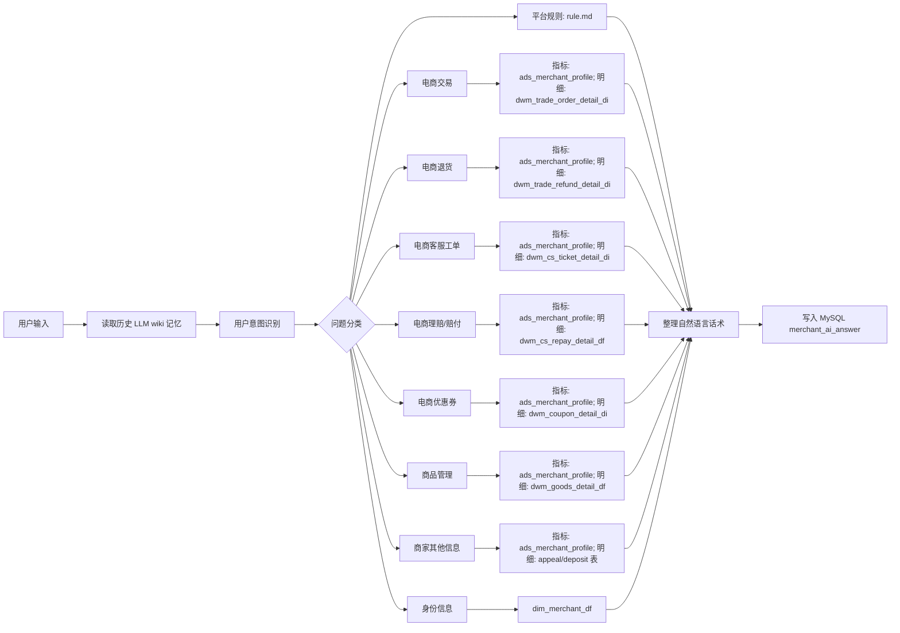

# yshopping 商家 AI 助手架构

## 问答流程

## 数据落库

`merchant_ai_answer` 字段：

- `id`: 每一次对话信息 id。
- `question`: 用户提问信息。
- `answer`: 模型回复信息。
- `is_adopted`: 用户是否点击采纳。
- `like_flag`: 点赞。
- `dislike_flag`: 点踩。
- `merchant_id`: 商家 id。
- `merchant_name`: 商家名称。
- `question_category_name`: 问题分类名称。
- `doris_tables`: 调用的 Doris 数据表。
- `suggested_questions`: 猜你想问。
- `create_time`: 创建时间。
- `modify_time`: 模型回复后的变更时间。

## 特殊策略

- 打招呼类输入只自然回复，不写入 `merchant_ai_answer`。
- 无效意图回复“请提工单进行人工咨询”，不写入 `merchant_ai_answer`。
- 当前本地商家 id 默认为 `100`。
- 最近 N 天且 N 大于 1 的指标按 `pt` 每日汇总。
- 明细类问题按商家/卖家 id 过滤，默认最多返回 20 条关键记录。
- 每日 10 点从 `ads_merchant_profile` 读取昨日数据并生成两条经营建议。

