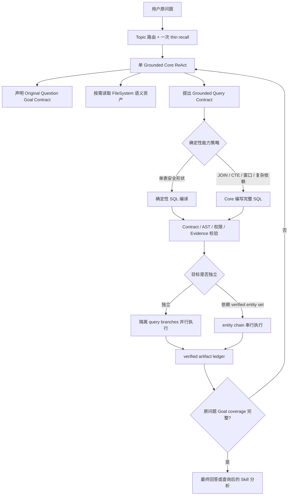

# Merchant AI 当前在线查数架构

当前在线查询由 `GroundedDeepAgentRuntime` 独占，不再回退到 legacy Planner、NodeAgent 或固定业务 workflow。底层 Deep Agents/LangGraph 仅承载通用的 model ↔ tool ReAct 循环；系统没有预先编排“先查 A、再查 B、最后分析”的业务 DAG。

## 主链路



这里固定的只有安全生命周期和因果约束：Contract 必须先于执行，SQL 必须通过 AST/权限校验，结果必须通过 Evidence 校验，依赖上游实体集合的查询必须等待上游 artifact。查几次、查什么、哪些独立目标组成 batch、何时修 SQL或继续补数，仍由同一个 Core 动态决定。

## 不是业务 workflow

- `GroundedApplicationRuntime` 是 composition root，不是 workflow scheduler。
- `GroundedDeepAgentRuntime` 只创建一个拥有查数工具的主 Core。
- 查询阶段禁止通过 `task` 派发 LLM subagent；并行查询 branch 不是 Agent，没有自己的推理循环。
- Goal Contract 只记录原问题“必须完成什么”，不选择表、不生成 SQL，也不规定执行顺序。
- Kernel 的 `phase`、generation、fingerprint 和 `nextAction` 是事务状态与 stale-result 防护，没有 dispatcher 根据这些字段自动跳转业务节点。
- `propose → activate`、`execute → verify` 是不可跳过的安全微流程，不负责决定下一项业务查询。

如果未来增加一个按 `phase` 或 Goal dependency 自动遍历和调度节点的 dispatcher，才会重新变成固定业务 workflow；当前设计明确不这样做。

## 确定性查询能力

执行策略只根据已经通过语义约束的 `GroundedQueryContract` 判断能力，不从用户文本猜表、字段或公式。

| Contract 形状 | 当前执行模式 | 约束 |
| --- | --- | --- |
| 单指标标量 | `DETERMINISTIC_METRIC` | 单表、已发布可执行指标 |
| 同表多指标标量 | `DETERMINISTIC_MULTI_METRIC` | 指标时间语义兼容 |
| 简单分组 | `DETERMINISTIC_GROUPED` | 单表、一个明确 group dimension |
| 简单趋势 | `DETERMINISTIC_TREND` | 单表、一个明确时间维度 |
| TopN / 排名 | `DETERMINISTIC_RANKED` | 排名指标、方向、limit 均已绑定 |
| 具体实体查询 | `DETERMINISTIC_ENTITY_LOOKUP` | 实体字段、操作符和值均已受治理绑定 |
| JOIN、CTE、窗口函数、复杂比较或依赖 | `CORE_SQL_REQUIRED` | 同一个 Core 提交完整 Doris `SELECT/WITH` SQL |

确定性编译器只投影 Contract 已确认的表、指标、维度、过滤、时间和排名，不补齐业务含义。任何超出当前编译能力的结构都 fail closed 到 `CORE_SQL_REQUIRED`，不会生成猜测性 fallback SQL。

## 并行查询

Core 先把相互独立的查询描述交给 `prepare_grounded_query_batch`。Runtime 为每个查询创建独立的 `GroundedRuntimeSession`：

- branch 拥有独立 session id、active generation、Contract、SQL candidate 和验证状态；
- Contract 准备目前由同一个 Core/工具串行完成；
- `execute_grounded_query_batch` 使用线程池并发进行 SQL candidate 校验、Doris 执行和 Evidence 校验；
- 所有 branch 共享线程安全的总时长、工具次数和 Doris 次数预算；
- 失败或未验证 branch 不修改主 session；
- 只有验证通过的 immutable query artifacts 才在锁内合并进主 ledger。

因此当前是“数据库执行分支并行”，不是“多个 LLM 并行规划”。这保留了单 Core 的一致决策上下文，同时减少多个独立查询串行等待 Doris 的耗时。

### Entity chain

例如：

```text
TopN 商品 → 发布 verified entity set → 查询这些商品的退款
```

第二步需要第一步的真实实体值，不能与第一步放进同一 batch。上游值保留在 Kernel 内，Core 只能引用 `entitySetArtifactId`；Executor 在权限校验后注入这些值，避免模型复制、遗漏或篡改实体集合。

## 准确性边界

每个串行查询和并行 branch 都必须独立通过：

1. 已读取语义证据形成的 Grounded Query Contract。
2. Contract generation 与 fingerprint 一致性检查。
3. SQL AST、只读约束、表/字段/relationship 和租户权限校验。
4. Doris 执行结果与输出结构检查。
5. Evidence 完整性与阻塞 gap 校验。
6. immutable verified query artifact 入账。

最后回答前还有一层 Original Question Goal coverage gate。Metric、Dimension、Time Window、Comparison、Entity 和 Dependency 等 required goals 必须被 verified artifacts 覆盖；缺任一目标时只能继续查数或明确失败，不能把部分结果包装成完整答案。

## 预算与遥测

一次 grounded run 共享同一个运行预算，默认包括：

- 总时长 90 秒；
- LLM provider call 上限；
- tool call 上限；
- Doris query 上限。

计数在外部操作开始前原子预留，因此并行 branch 不能超卖预算。Debug trace 记录总用量、按名称调用次数、拒绝的超限尝试，以及 bootstrap、routing、recall、Core、各工具、串行/并行 Doris 和 Evidence 阶段的耗时。预算耗尽时返回受控 operational failure；未完成或未验证的部分结果不会成为最终答案。

## Skill 边界

当前 Skill 是查询完成后的隔离分析器：只有 Goal coverage 和 verified evidence portfolio 均通过后，Core 才能看到 Skill header。Skill 启动后不能再读取查询语义、建立 Contract 或执行 SQL。该边界与查数主链路分开，本阶段不让 Skill 参与取数规划。
