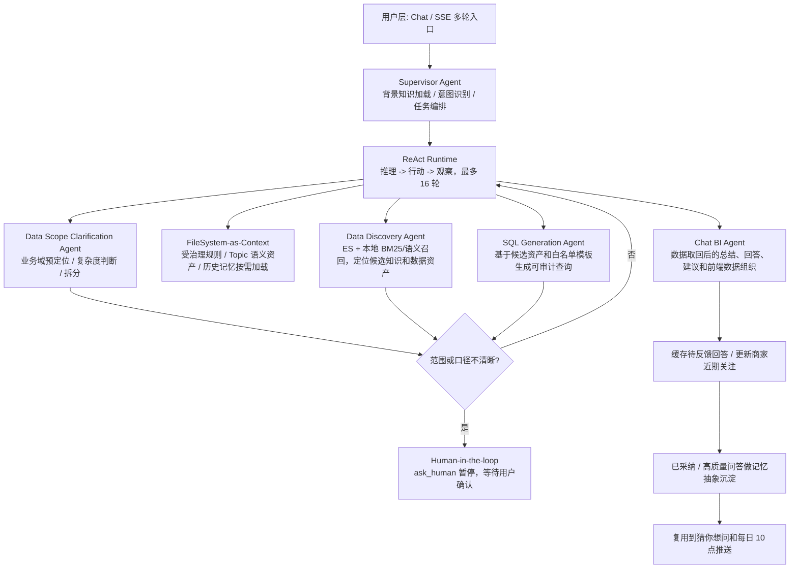

# yshopping 商家 AI 助手架构

## 问答流程

## 数据落库

`merchant_ai_answer` 字段：

- `id`: 每一次对话信息 id。
- `question`: 用户提问信息。
- `answer`: 模型回复信息。
- `is_adopted`: 用户是否点击采纳。
- `like_flag`: 点赞。
- `dislike_flag`: 点踩。
- `merchant_id`: 商家 id。
- `merchant_name`: 商家名称。
- `question_category_name`: 问题分类名称。
- `doris_tables`: 调用的 Doris 数据表。
- `suggested_questions`: 猜你想问。
- `create_time`: 创建时间。
- `modify_time`: 模型回复后的变更时间。

## 特殊策略

- 打招呼类输入只自然回复，不写入 `merchant_ai_answer`。
- 无效或范围不清晰的问题不继续猜测，优先进入 Human-in-the-loop 澄清，不写入 `merchant_ai_answer`。
- Supervisor Agent 只做背景加载、一级路由和任务编排；后续由 ReAct Runtime 动态选择专业子 Agent。
- 业务问题先由 Data Scope Clarification Agent 收敛业务域，再由 FileSystem-as-Context 按需加载受治理规则、Topic 语义资产和少量历史记忆。
- Data Discovery Agent 执行 `BM25/关键词 + 向量语义 + ES metadata` 混合召回，并把候选知识/数据资产写回状态。
- SQL Generation Agent 只接受白名单内的业务分类、字段和查询模板，避免模型直接拼接不可审计 SQL。
- Chat BI Agent 负责基于数据结果做自然语言解读、经营建议、猜你想问和前端可视化数据组织。
- 当前本地商家 id 默认为 `100`。
- 最近 N 天且 N 大于 1 的指标按 `pt` 每日汇总。
- 明细类问题按商家/卖家 id 过滤，默认最多返回 20 条关键记录。
- 有效问答会进入 MySQL 记录表，已采纳或高质量问答会进一步沉淀为可复用记忆，支持运营人工补充。
- 每日 10 点从 `ads_merchant_profile` 读取昨日及近 7 日核心指标，生成经营摘要与两条关键建议后推送商家助手。

## 查询改写

- 系统收到问题后会先做一级路由，把输入分成 `GREETING`、`INVALID` 和 `BUSINESS` 三类。
- `GREETING` 只做自然回复，不进入后续业务链路，也不写入问答记录。
- `INVALID` 用于空问题、表达不明确或缺少业务对象的问题，优先通过 `Human-in-the-loop` 让用户补充分析范围。
- `BUSINESS` 会进入 ReAct Runtime，由 Runtime 按状态调度结构拆分、上下文加载、召回、意图识别、Doris 查询和答案生成。
- 一级路由阶段还会同步做复杂度预判；如果问题较长，或者包含“分析、原因、为什么、并且、分别、综合”等词，会优先标记为复杂问题。
- 除了分析类关键词，系统也会把多指标、跨业务域、多时间点的问题识别为复杂问题，例如“最近7天订单量、退货量和工单量分别是多少”或“7天的 GMV 和 10 天的退货量一起看”。
- 对复杂问题，系统会优先使用 LLM 做结构拆分，把原问题改写成多个更适合执行的子问题，重点覆盖多指标、跨域和多个时间点这三类场景。
- 如果问题本质上是“为什么、原因、影响、关联、分析”这类分析型问题，LLM 会尽量保留整句，不做机械拆分，避免把原始语义拆散。
